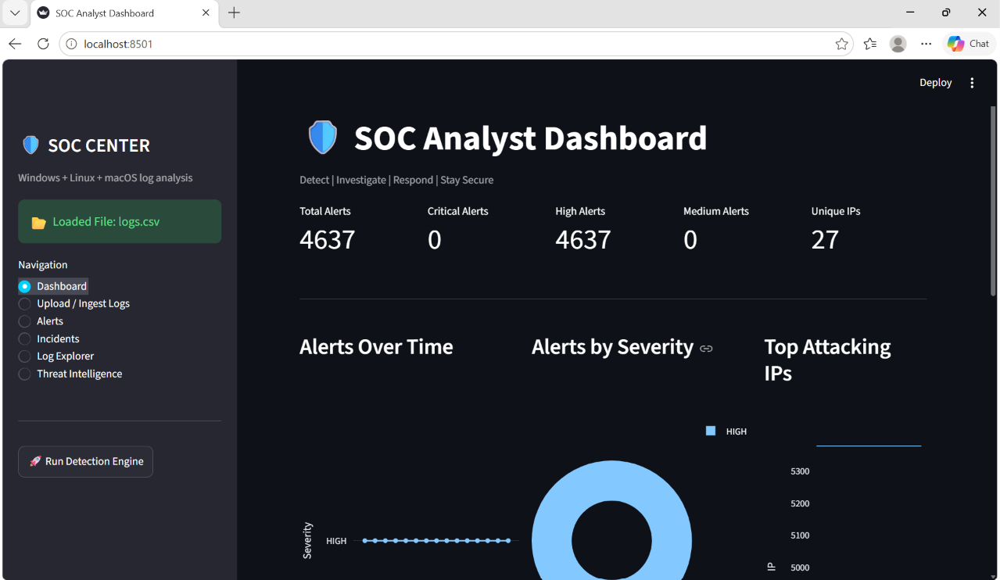
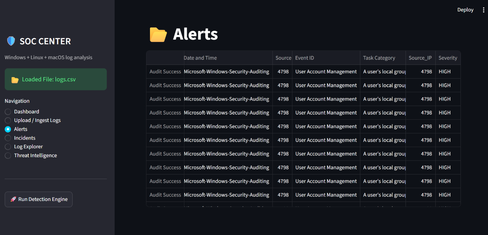
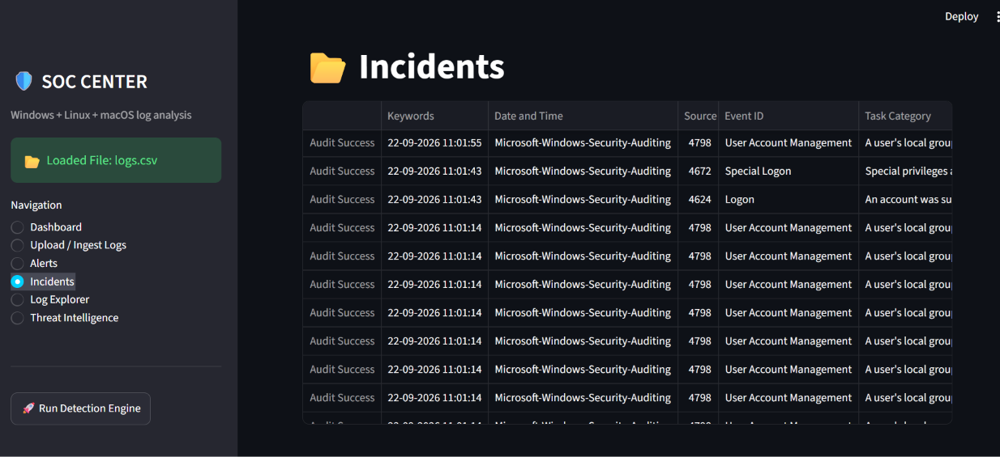
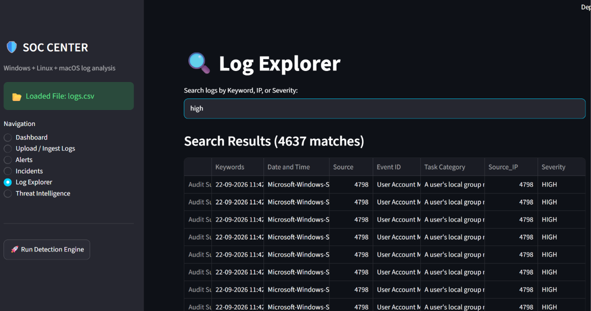
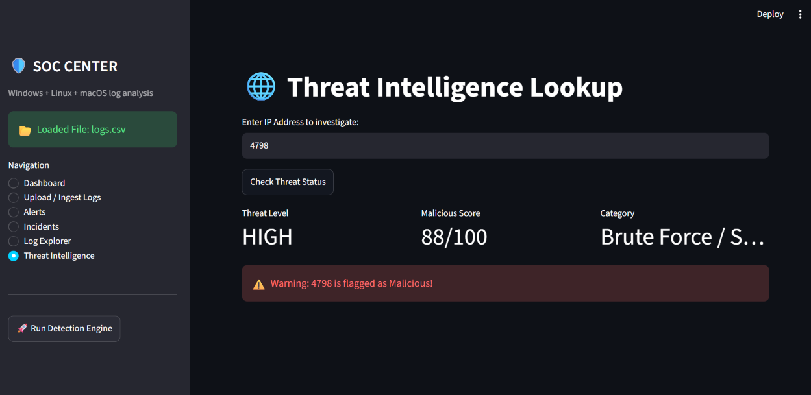

# 🛡️ SOC Analyst Dashboard & Log Analysis Tool

An interactive, multi-page Security Operations Center (SOC) Log Analysis Dashboard built using *Python, Streamlit, Pandas, and Plotly*. This tool ingests system and security logs (.csv, .log, .txt), parses threat severity, displays real-time detection metrics, and allows security analysts to perform threat intelligence lookups.

---

## 📸 Screenshots

### 1. Main Dashboard Overview


### 2. Alerts Tracker


### 3. Incidents Management


### 4. Searchable Log Explorer


### 5. Threat Intelligence Lookup


---

## 🚀 Features

- 📊 *Real-Time SOC Dashboard:* Dynamic visualizations for total alerts, critical/high severities, and unique attacking IPs using Plotly.
- 📥 *Log Ingestion & Parsing:* Session-state backed engine supporting .csv, .txt, and .log formats with custom severity detection.
- 🚨 *Alerts & Incidents Tracker:* Instant categorization and tabular visibility of security event logs.
- 🔍 *Interactive Log Explorer:* Fast searching and filtering across log files by IP, Keyword, or Severity level.
- 🌐 *Threat Intelligence Lookup:* IP investigation interface to verify malicious indicators and threat levels.

---

## 🛠️ Tech Stack

- *Frontend / UI:* Streamlit
- *Data Processing:* Pandas, Regular Expressions (Re)
- *Data Visualization:* Plotly Express
- *Language:* Python 3.x

- ## 💻 How to Run Locally

1. *Clone the repository:*
   ```bash
   git clone [https://github.com/YOUR_USERNAME/SOC-Analyst-Dashboard.git](https://github.com/YOUR_USERNAME/SOC-Analyst-Dashboard.git)
   cd SOC-Analyst-Dashboard
2. Install dependencies:
                        pip install -r requirements.txt
3. Launch the application:
                        Streamlit run app.py
